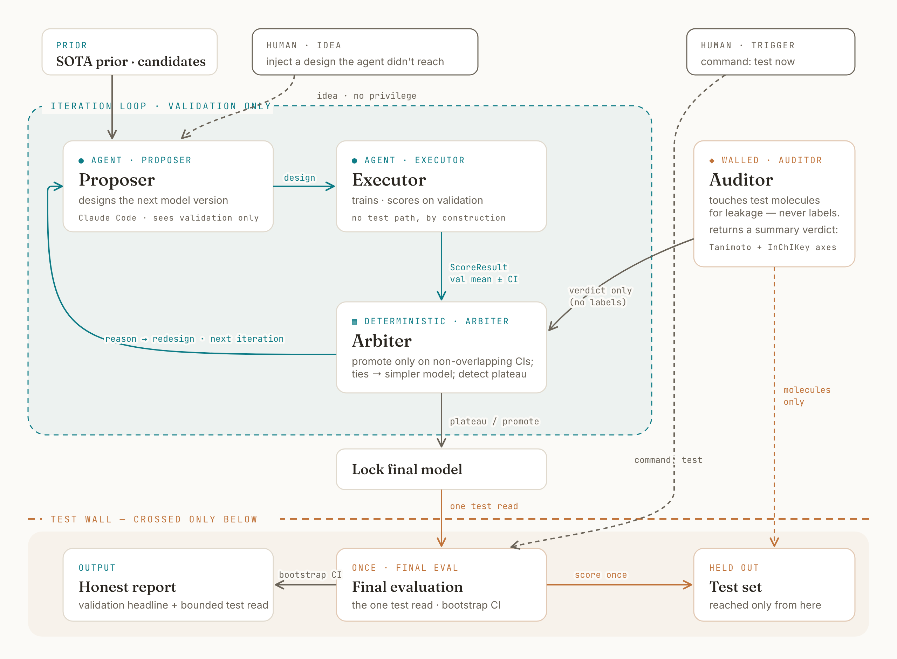

# ADMET-honest-audit — an agent that climbs the TDC ADMET leaderboard honestly, and audits it while doing so

**What this is.** ML leaderboards look precise, but a Feb 2026 audit of the TDC
ADMET benchmark ([Koleiev et al., bioRxiv 2026.02.26.708193](https://doi.org/10.64898/2026.02.26.708193))
found most top entries fail on non-reproducibility or data leakage, and that
*overfitting the open test set* moves a model up the board — so climbing and
cheating can be the same act. `nest AI` is an agentic pipeline (driven by Claude
Code) that iteratively improves ADMET models **without** test-set overfitting and
**audits the benchmark's integrity as it goes**. The headline finding, across 10
of 22 endpoints: **honest iteration climbs where there is real signal (3/10,
always the same physically-motivated descriptors-beat-fingerprints move) and
plateaus where there is not (7/10), and on the small endpoints the leaderboard's
fine-grained ranks sit inside the test-set sampling noise.** Validation is always
the headline; the one test read carries a bootstrap CI. We do **not** claim to
match SOTA on solubility — our honest estimate is the validation number, the test
point is a favorable draw, and that split is contaminated.

## Architecture — four roles and a structural test wall

Honesty is enforced by *what each module can import*, not by good intentions. The
climb loop runs entirely on validation; the test set is crossed exactly once:



*Diagram source: [`architecture_flow.html`](architecture_flow.html) (self-contained; re-export to `figures/architecture.png` to update).*

| role | file | can it touch test? |
|---|---|---|
| **proposer** | candidate model specs in `models/*.py` (`FEATURES` + `build(seed)`) | no |
| **executor** | `roles/executor.py` | **no** — trains/scores on `train`/`valid` only; grep-clean of any test call |
| **arbiter** (deterministic, no model/LLM) | `roles/arbiter.py` | **no** — CI-overlap promotions, parsimony on ties, plateau detection |
| **walled auditor** | `roles/auditor.py` | **molecules only** — computes NN-Tanimoto + InChIKey identity, returns a frozen `LeakageVerdict` with **no labels and no per-molecule data** |
| **final-eval** | `testwall/final_eval.py` | **labels, once** — the only caller of `load_test_labeled()`, invoked after the model is locked |
| **orchestrator** | `run.py` | wires the above; its **iteration path has no code path to test** |

The benchmark adapter (`benchmarks/`) exposes `load_train_valid()` /
`load_train_reference()` / `load_test_molecules()` (SMILES, no `Y`) to the loop,
and `load_test_labeled()` only to final-eval. The test read goes through a
read-counter (`testwall/read_counter.py`) that widens the reported CI when a test
set is reused. This isolation is the substance of the "is this honest" claim.

## Reproduce our results

### Environment (fresh clone)
Python 3.11 (pinned in `.python-version`); [uv](https://docs.astral.sh/uv/) manages
the env. The runtime pipeline is **rdkit + lightgbm + scikit-learn/scipy + pandas** —
PyTDC (and its torch/numba/tiledbsoma stack) is **not** a runtime dependency, so the
core install is small and works on any platform (macOS, Linux, no CUDA required).

**macOS: `brew install libomp` before `uv sync`** (LightGBM's `.dylib` links the
OpenMP runtime; without it `import lightgbm` fails to load). Linux wheels bundle it.

```bash
brew install libomp           # macOS only, one-time (skip on Linux)
uv sync                       # builds .venv from pyproject.toml + uv.lock (no torch/tdc)
uv run python -c "import rdkit, lightgbm, sklearn, scipy; print('env OK')"
```

PyTDC is only needed to **download** endpoints not already cached (see Data). Install
that optional extra only if you need a fresh download:

```bash
uv sync --extra download      # adds pytdc (pulls torch/numba); NOT needed to reproduce
```

### Data
The 22 ADMET endpoints **ship with the repo**, cached as CSVs under
`data/admet_group/<endpoint>/{train_val,test}.csv`, so a fresh clone reproduces with
**no download**. The adapter (`benchmarks/tdc_admet.py`) reads them **directly** (not
through PyTDC at runtime) and reproduces TDC's scaffold train/valid split with a
verbatim-vendored splitter (`benchmarks/_scaffold_split.py`). This pins reproducibility
to a fixed data snapshot (**PyTDC 1.1.15**) — which matters, because TDC has no dataset
versioning (see the leakage findings). To (re)populate an endpoint from scratch (needs
`uv sync --extra download`): `TDCAdmetAdapter.download_endpoint("<name>")` (the only
PyTDC path anywhere).

### One endpoint, end to end (~2–3 min)
Runs the full loop on cyp2d6_substrate and takes the single test read:

```bash
uv run python -c "
from config import Config
from run import Orchestrator, load_specs
o = Orchestrator(Config('cyp2d6_substrate_carbonmangels'))
o.run_loop(load_specs(['v01_desc_rf','v02_desc_lgbm','v03_desc_morgan_rf',
                       'v04_desc_morgan_rf_balanced','v05_stacked_meta','v06_late_fusion']))
r = o.request_test()
print('lock      :', o.locked_name)
print('validation:', r.validation_headline)          # the headline
print('test read :', round(r.read.test_point,3), r.read.bootstrap_ci)
print('leakage   :', 'clean' if r.leakage.clean else 'FLAGGED',
      'n_exact_identity=', r.leakage.n_exact_identity)
"
```

Expected (all validation-selected; test touched once): **lock `v04_desc_morgan_rf_balanced`**,
validation **PR-AUC 0.626 ± 0.053** (headline), one-shot **test 0.686, bootstrap
95% CI [0.552, 0.804]**, **leakage clean** (`n_exact_identity=0`). The wide test CI
(±0.13 on 135 test molecules) is the point: it spans most of the leaderboard.

### The three-endpoint verified regression (~15–20 min)
Asserts the validated numbers for cyp2d6 / solubility / caco2 and the
data-sufficiency gate; exits non-zero on any divergence:

```bash
uv run python -m roles.verify_stage5     # dominated by solubility's stacked model
```

### The 10-endpoint evidence run (~15–25 min)
Runs the orchestrator over 7 further endpoints and prints the per-endpoint results
that `FINDINGS_MULTI.md` synthesizes (it prints; it does not write the `.md`):

```bash
uv run python run_multi.py
```

## Use it as a tool (any cached endpoint)

The pipeline is endpoint-agnostic — point `Config` at any of the 22:

```python
from config import Config
from run import Orchestrator, load_specs

cfg = Config("bbb_martins",           # any cached endpoint
             novelty_tier="middle",   # 'low' | 'middle' | 'high'
             max_loops=12, force_full=False, plateau_k=3)
orch = Orchestrator(cfg)              # resolves metric/direction/seed-budget by exact name
orch.run_loop(load_specs([...]))     # candidate model specs (proposer stream)
# orch.inject_idea(spec)             # human idea -> same executor/arbiter discipline, no privilege
read = orch.request_test()           # user-commanded; NOT auto-fired; goes through the read-counter
```

- **Novelty-tier gate:** `novelty_tier="high"` (bespoke architectures) is *refused*
  when the test set is too small to support the claim — e.g. cyp2d6 (135 test /
  ~37 minority positives) raises `ValueError` at construction. Thresholds in
  `config.py` (`HIGH_TIER_MIN_TEST_SIZE=300`, `HIGH_TIER_MIN_MINORITY=100`).
- **Human-in-the-loop, same accounting:** `inject_idea()` runs a user design
  through the identical executor→arbiter path; `request_test()` is explicit (test
  is never auto-fired) and every read is counted — reuse widens the reported CI,
  and an idea injected after a prior read flags the next read adaptive.
- **Validation stays the headline** in every read; the test point ships with its
  bootstrap CI and a flagged valid-vs-test gap when the test draw is favorable.

## Findings and provenance

- **[`FINDINGS_MULTI.md`](FINDINGS_MULTI.md)** — the 10-endpoint synthesis:
  separates-vs-plateaus (3/10 vs 7/10), CI-width-vs-test-size, and the leakage /
  issue-#217 version-drift results (real InChIKey duplicates on solubility (7) and
  bbb_martins (2, salt-form pairs Tanimoto missed); #217 patched on caco2 and ld50,
  still live on bbb_martins).
- **[`LEADERBOARD_COMPARISON.md`](LEADERBOARD_COMPARISON.md)** — our reads vs the
  (quarantined, reference-only) leaderboard numbers, honestly framed.
- **The git history is the research trail** — one commit per model version with its
  design rationale, so the *reasoning* is reproducible, not just the numbers. The
  refactor was staged (adapter → executor → arbiter → walled auditor →
  orchestrator), each stage committed with a regression check proving it reproduces
  the validated numbers against its predecessor.

## Repo map

```
benchmarks/     adapter: base.py, tdc_admet.py, _scaffold_split.py (vendored)   [active]
roles/          executor.py, arbiter.py, auditor.py                            [active]
testwall/       final_eval.py, read_counter.py (the only test-label path)      [active]
config.py       run config + data-sufficiency gate                            [active]
run.py          orchestrator (the entry point for a run)                      [active]
models/         candidate model specs (the proposer stream)                   [active]
run_multi.py    10-endpoint evidence driver
FINDINGS_MULTI.md / LEADERBOARD_*.md / SOTA_PRIOR*.md   results & frozen priors
verify_stage3/4/5.py, build_metric_map.py, verify_direction.py   reproducibility checks [kept]
```

The older per-endpoint scripts (`iterate_*.py`, `data_split_*.py`, `final_test_eval_*.py`,
and the stage1/stage2 migration harnesses) from the staged development have been
**removed** (Stage 6 cleanup) — they were dead code that the consolidated pipeline above
does not import. The staged refactor and its per-stage regression checks remain fully
visible in the git history, which is the research trail. The `verify_stage3/4/5.py`,
`build_metric_map.py`, and `verify_direction.py` reproducibility checks are self-standing
and kept (the last two use PyTDC's metadata, so they need `uv sync --extra download`).
